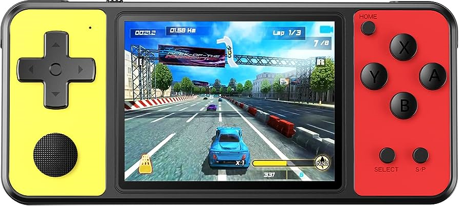

# Videoconsola con CSS

## Tecnologías utilizadas

  

## Tabla de contenidos

- [Descripción del proyecto :bulb:](#Descripción-del-proyecto)
- [Acceso⛏️](#Acceso)
- [Desarrollo 🪛](#Desarrollo)
- [Estado Actual :✔️](#Estado)
- [Desarrolladores del Proyecto :🙋](#Desarrolladores-del-Proyecto)
- [Contribuyentes y agradecimiento :🤝](#Contribuyentes-y-agradecimiento.)
- [Licencia :🏆](#Licencia)
- [Conclusiones :🕹️](#Conclusiones)
- [Contacto :☎️](#Contacto)

### Descripción del proyecto

En este primer proyecto académico, se nos encargó la reproducción de una consola a elección. El objetivo es el aprendizaje de las herramientas y propiedades de CSS.

Como se puede ver se trata de una reproducción -salvando las diferencias- de la videoconsola portátil Game & Watch: ZHISHAN Consola de juegos de mano para niños con pantalla de 3 pulgadas, con 270 videojuegos clásicos retro. Conocidas popularmente en España como **"maquinitas"**.

### Acceso

El lanzamiento que replica la videoconsola es muy sencillo, solo tienes que darle al acceso de :rocket: GitHub-pages o puedes descargar el código.

### Desarrollo

El proyecto se desarrolló utilizando las tecnologías de **HTML** y **CSS**. Comenzando por la estructura del mismo usando en su mayoría, contenedores (_< div >_). 

Continuando con los estilos y propiedades en CSS para intentar dar un aspecto real y/o similar a la imagen original. Entre las propiedades que se aplicaron estan:  _box-shadow, background-image (hover...), border o border-radius_, entre otras. 

Las únicas imágenes utilizadas en la realización de la consola son los logotipos pertenecientes a **Zhishan**, como así también el estilo de la consola.

### Estado Actual

A futuro se pretende incluir nuevas funcionalidades, tales como la integración de elementos: Java Script. Y perfeccionar el diseño dándole una mayor similitud a la realidad.

### Desarrolladores del Proyecto

Este proyecto ha sido realizado únicamente por mí.

### Contribuyentes y agradecimiento

Agradecimiento absoluto a los cursos on-line, por su ayuda en las distintas fases del proyecto.

### Licencia

Sin licencia aplicada.

### Conclusiones 

A nivel personal este primer desafío, me permitió identificar mis debilidades y aplicar mis fortalezas a la hora de desarrollar un proyecto. También, entender la interacción entre los diferentes lenguajes y herramientas, aprender a gestionar mis tiempos y priorizar las diferentes fases de este. 

### Contacto
<a href = "mailto:fedeldt1@gmail.com"> 

**¡Me encuentro listo para el siguiente desafío!**